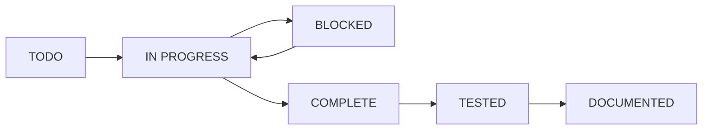

# Task Tracking System - Cognitive Meeting Intelligence

## Overview

This document defines our dual-track task management system that separates:
1. **Setup/Infrastructure Tasks** (PROJECT-XXX) - Tracked in this file
2. **Implementation Tasks** (IMPL-XXX) - Tracked in memories and progress docs

## Task Numbering Convention

### Setup/Infrastructure Tasks (PROJECT-XXX)
- `PROJECT-001` through `PROJECT-999`: Project setup, tooling, documentation
- `INFRA-001` through `INFRA-999`: Infrastructure, CI/CD, deployment
- `MAINT-001` through `MAINT-999`: Maintenance, cleanup, refactoring
- `DOC-001` through `DOC-999`: Documentation improvements

### Implementation Tasks (IMPL-XXX)
- `IMPL-D1-XXX`: Day 1 implementation tasks
- `IMPL-D2-XXX`: Day 2 implementation tasks
- etc.

## Current Project Setup Tasks

### 🚨 Critical (Must do before ANY implementation)

#### PROJECT-001: Initialize Git Repository ✅
**Status**: COMPLETED
**Priority**: CRITICAL
**Description**: Project has no git history - must initialize before any work
**Tasks**:
- [x] Run git init
- [x] Create .gitignore
- [x] Make initial commit
- [x] Connect to remote repository

#### PROJECT-002: Create Missing Essential Files
**Status**: COMPLETED ✅
**Priority**: HIGH
**Assignee**: Current session
**Description**: Critical files referenced but missing
**Tasks**:
- [x] Create src/models/entities.py (Day 1 foundation)
- [x] Create CHANGELOG.md
- [x] Create scripts/check_project_state.py
- [x] Create .github/pull_request_template.md
- [x] Create docs/progress/000_initial_setup.md

#### PROJECT-003: Consolidate Duplicate Memories
**Status**: TODO
**Priority**: HIGH
**Description**: Multiple overlapping phase documentation memories
**Tasks**:
- [ ] Merge phase3_implementation_tasks + phase3_implementation_tasks_detailed
- [ ] Archive superseded memories
- [ ] Create memory hierarchy document
- [ ] Update memory naming convention

#### PROJECT-004: Create Development Environment Files
**Status**: TODO
**Priority**: HIGH
**Description**: Environment configuration for development
**Tasks**:
- [ ] Create .env.example with all variables documented
- [ ] Create .env.development with dev settings
- [ ] Create .env.test for test environment
- [ ] Update .gitignore to exclude .env files

#### PROJECT-005: Create Developer Setup Documentation
**Status**: TODO
**Priority**: MEDIUM
**Description**: Consolidate setup instructions
**Tasks**:
- [ ] Create DEVELOPER_SETUP.md with complete setup steps
- [ ] Include Python version requirements
- [ ] Document all service dependencies
- [ ] Add troubleshooting section

### 🔧 Infrastructure Tasks

#### INFRA-001: Setup Pre-commit Hooks
**Status**: TODO
**Priority**: MEDIUM
**Description**: Automate code quality checks
**Tasks**:
- [ ] Create .pre-commit-config.yaml
- [ ] Configure black, flake8, mypy hooks
- [ ] Add to developer setup docs
- [ ] Test with team

#### INFRA-002: CI/CD Pipeline
**Status**: TODO
**Priority**: MEDIUM
**Description**: GitHub Actions for automated testing
**Tasks**:
- [ ] Create .github/workflows/test.yml
- [ ] Create .github/workflows/lint.yml
- [ ] Setup code coverage reporting
- [ ] Add status badges to README

### 📝 Documentation Tasks

#### DOC-001: Create Technical Specification Documents
**Status**: TODO
**Priority**: HIGH
**Description**: Detailed specs for each implementation phase
**Tasks**:
- [ ] Create docs/specs/day1-data-models.md
- [ ] Create docs/specs/day2-embeddings.md
- [ ] Create docs/specs/day3-vector-composition.md
- [ ] Link specs to IMPLEMENTATION_GUIDE.md

#### DOC-002: API Documentation
**Status**: TODO
**Priority**: MEDIUM
**Description**: Comprehensive API documentation
**Tasks**:
- [ ] Setup Sphinx or MkDocs
- [ ] Configure auto-generation from docstrings
- [ ] Create API usage examples
- [ ] Deploy to GitHub Pages

## Implementation Task Tracking

Implementation tasks are tracked separately to maintain clarity:

### Where Implementation Tasks Live:
1. **Task Definitions**: In memories (e.g., `phase1_implementation_tasks`)
2. **Technical Specs**: In `docs/specs/` directory
3. **Progress Tracking**: In `docs/progress/XXX_name.md` files
4. **Status Updates**: In TASK_COMPLETION_CHECKLIST.md

### Implementation Task Format:
```
IMPL-D1-001: Create Memory dataclass
├── Spec: docs/specs/day1-data-models.md#memory-class
├── File: src/models/entities.py
├── Tests: tests/unit/test_models.py::TestMemory
├── Status: [ ] Planned [ ] In Progress [ ] Complete [ ] Tested
└── Dependencies: None
```

## Task Status Workflow



## Best Practices

### 1. Task Creation
- Project tasks: Add to this file immediately when discovered
- Implementation tasks: Add to relevant memory or create new spec

### 2. Task Assignment
- Claim tasks by adding your name/session
- Update status when starting work
- Document blockers immediately

### 3. Task Completion
- Mark subtasks as complete
- Update overall status
- Create progress document if significant
- Link to relevant commits

### 4. Regular Reviews
- Weekly: Review and update all PROJECT/INFRA tasks
- Daily: Check IMPL task progress in memories
- Sprint end: Archive completed tasks

## Current Sprint Focus

### Sprint 0: Project Setup (Current)
**Goal**: Ready for Day 1 implementation
**Tasks**:
- PROJECT-001 ✅
- PROJECT-002 (in progress)
- PROJECT-003
- DOC-001

### Sprint 1: MVP Week 1
**Goal**: Complete Days 1-7 implementation
**Tracking**: See memories and progress docs

## Quick Links

- [IMPLEMENTATION_GUIDE.md](../IMPLEMENTATION_GUIDE.md) - Authoritative roadmap
- [TASK_COMPLETION_CHECKLIST.md](../TASK_COMPLETION_CHECKLIST.md) - Implementation status
- [Progress Documents](progress/) - Detailed session logs
- [Technical Specs](specs/) - Detailed requirements

---

**Last Updated**: 2024-12-19
**Next Review**: After PROJECT-002 completion